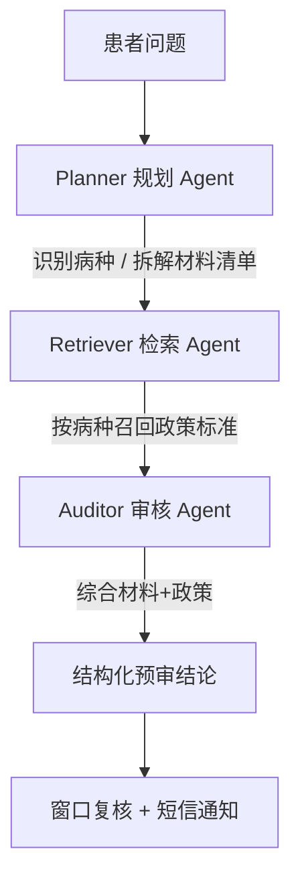

# 多 Agent 协作流程图

## 流程（Mermaid）

## 各 Agent 职责

| Agent | 输入 | 输出 | 关键点 |
|---|---|---|---|
| **Planner** | 患者自然语言问题 | 病种标签 + 需核对材料清单 | 实体识别（病名/材料） |
| **Retriever** | 病种标签 | 对应政策标准片段 | 可接 Milvus / 政策库 |
| **Auditor** | 材料 + 政策 | 结构化预审结论 | 规则判定 + 异常转人工 |

## 为什么用多 Agent 而非单链

- **职责解耦**：病种识别、政策检索、合规审核各司其职，便于单独优化与替换（如 Retriever 换成 RAG 服务）。
- **可观测**：每个 Agent 的输入输出可单独记录、评估、重试。
- **可扩展**：后续可加「申诉 Agent」「人工复核 Agent」，用同一张图编排。
- **对齐 JD**：楚天云「大模型算法研发工程师」明确要求 LangChain/LangGraph，本项目即以此实现。
